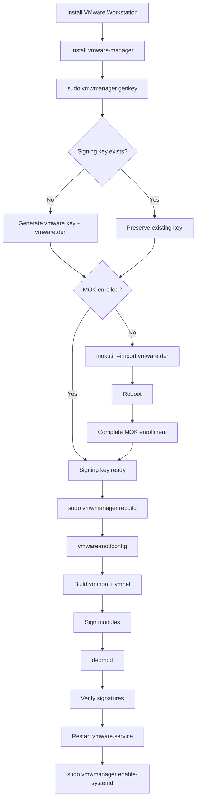
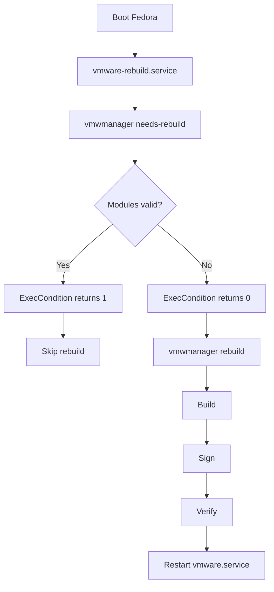

# vmware-manager

Secure Boot compatible VMware host-module manager for Fedora.

`vmware-manager` provides the `vmwmanager` command for building, signing, verifying, reinstalling, and maintaining the VMware Workstation host kernel modules:

- `vmmon.ko`
- `vmnet.ko`

It is designed for Fedora systems using Secure Boot and Machine Owner Keys (MOK).

> **Important**
>
> `vmware-manager` does not distribute VMware Workstation.
> VMware Workstation must be installed separately.

---

## Table of Contents

- [Overview](#overview)
- [Features](#features)
- [Requirements](#requirements)
- [Architecture](#architecture)
- [Workflow](#workflow)
- [Installation](#installation)
  - [COPR](#copr)
  - [RPM](#rpm)
- [Quick Start](#quick-start)
- [Commands](#commands)
  - [genkey](#genkey)
  - [status](#status)
  - [needs-rebuild](#needs-rebuild)
  - [rebuild](#rebuild)
  - [reinstall](#reinstall)
  - [enable-systemd](#enable-systemd)
  - [disable-systemd](#disable-systemd)
  - [uninstall](#uninstall)
  - [purge](#purge)
- [Secure Boot and MOK](#secure-boot-and-mok)
- [Kernel Handling](#kernel-handling)
- [VMware Module Compilation](#vmware-module-compilation)
- [Module Signing](#module-signing)
- [systemd Integration](#systemd-integration)
- [Kernel Update Workflow](#kernel-update-workflow)
- [Troubleshooting](#troubleshooting)
- [Uninstallation](#uninstallation)
- [Testing](#testing)
- [Contributing](#contributing)
- [Security](#security)
- [License](#license)

---

# Overview

VMware Workstation requires the following host kernel modules:

```text
vmmon.ko
vmnet.ko
```

On systems with Secure Boot enabled, kernel modules must be signed with a trusted certificate before the kernel can load them.

`vmwmanager` manages this process while continuing to use VMware's native module builder:

```text
vmware-modconfig --console --install-all
```

The manager can:

1. generate a dedicated VMware signing key;
2. request MOK enrollment;
3. build VMware's native host modules;
4. sign `vmmon.ko` and `vmnet.ko`;
5. verify their signatures;
6. update module dependencies;
7. restart `vmware.service`;
8. automatically check the modules at boot using systemd.

No alternative VMware host-module implementation is downloaded or installed automatically.

---

# Features

- Fedora-oriented VMware host-module management
- Secure Boot support
- MOK key generation and enrollment
- VMware native `vmware-modconfig` integration
- `vmmon.ko` signing
- `vmnet.ko` signing
- Signature verification
- Running-kernel detection
- Fedora default boot-kernel reporting
- VMware service status inspection
- Automatic module checking at boot
- Conditional systemd rebuilds
- Forced module reinstallation
- Safe integration cleanup
- No automatic third-party module fallback
- Idempotent systemd disable operation

---

# Requirements

VMware Workstation must already be installed for operations that build or manage VMware host modules.

The RPM requires the tools needed for compilation, signing, Secure Boot and systemd integration, including:

```text
bash
git
gcc
make
kernel-devel
openssl
mokutil
dracut
kmod
systemd
```

The installed manager command is:

```text
/usr/bin/vmwmanager
```

VMware's service is expected to be:

```text
vmware.service
```

---

# Architecture

```text
                     ┌─────────────────────┐
                     │  VMware Workstation │
                     └──────────┬──────────┘
                                │
                                │ vmware-modconfig
                                ▼
                     ┌─────────────────────┐
                     │   vmmon.ko          │
                     │   vmnet.ko          │
                     └──────────┬──────────┘
                                │
                                │ sign-file
                                ▼
                    ┌────────────────────────┐
                    │ VMware MOK certificate │
                    │ VMware signing key     │
                    └───────────┬────────────┘
                                │
                                ▼
                     ┌─────────────────────┐
                     │ Signed host modules │
                     └──────────┬──────────┘
                                │
                                │ depmod
                                ▼
                     ┌─────────────────────┐
                     │   Linux kernel      │
                     └─────────────────────┘
```

The signing material is stored under:

```text
/var/lib/shim-signed/mok/
```

using:

```text
vmware.key
vmware.der
```

The expected certificate common name is:

```text
VMware Module Signing
```

---

# Workflow

The normal Secure Boot setup is:



After setup:



---

# Installation

## COPR

Enable the COPR repository:

```bash
sudo dnf copr enable hhlp/vmware
```

Install the package:

```bash
sudo dnf install vmware-manager
```

Verify:

```bash
vmwmanager help
```

## RPM

A locally built RPM can be installed with:

```bash
sudo dnf install ./vmware-manager-*.rpm
```

---

# Quick Start

With VMware Workstation already installed:

```bash
sudo vmwmanager genkey
```

If MOK enrollment is requested, reboot:

```bash
sudo reboot
```

Complete the enrollment from the blue MOK Manager screen.

After returning to Fedora:

```bash
sudo vmwmanager status
```

Build and sign the VMware modules if required:

```bash
sudo vmwmanager rebuild
```

Then optionally enable automatic checking at boot:

```bash
sudo vmwmanager enable-systemd
```

Verify:

```bash
vmwmanager status
```

---

# Commands

The command syntax is:

```text
vmwmanager <command>
```

Available commands:

```text
genkey
status
needs-rebuild
rebuild
reinstall
uninstall
purge
enable-systemd
disable-systemd
help
```

## genkey

```bash
sudo vmwmanager genkey
```

Requires VMware Workstation to be installed.

If the signing key does not exist, `genkey` creates:

```text
/var/lib/shim-signed/mok/vmware.key
/var/lib/shim-signed/mok/vmware.der
```

The private key is protected with mode:

```text
0600
```

and the certificate with:

```text
0644
```

If both files already exist, they are preserved.

The manager does **not** silently replace an incomplete key pair. If only the private key or only the certificate exists, it reports the inconsistent state and stops.

If the certificate is not enrolled, the existing certificate is submitted with:

```bash
mokutil --import /var/lib/shim-signed/mok/vmware.der
```

The user then completes enrollment manually during the next reboot.

---

## status

```bash
vmwmanager status
```

This is primarily a read-only diagnostic command.

It reports:

- VMware Workstation installation state
- running kernel
- Fedora default boot kernel, when available
- Secure Boot state
- signing-key state
- MOK enrollment
- `vmmon.ko` presence
- `vmnet.ko` presence
- module signer
- module loaded state
- `vmware.service` state
- `vmware-rebuild.service` integration

For example:

```bash
vmwmanager status
```

can be used after:

```bash
sudo vmwmanager genkey
sudo vmwmanager rebuild
```

to verify the complete configuration.

---

## needs-rebuild

```bash
vmwmanager needs-rebuild
```

This command is primarily intended for:

```ini
ExecCondition=/usr/bin/vmwmanager needs-rebuild
```

It checks both VMware modules for the **running kernel**.

Its exit-status semantics are intentionally inverted compared with a traditional status command:

```text
0 = rebuild required
1 = rebuild not required
```

A rebuild is required when either module:

- does not exist;
- is unsigned; or
- is not signed with the expected VMware signing certificate.

When both modules already exist and have the correct signature:

```text
vmmon.ko → valid
vmnet.ko → valid
```

the command returns:

```text
1
```

This tells systemd's `ExecCondition` to skip `ExecStart`.

A return code of `1` from this command therefore does **not** mean that the VMware modules failed.

For this specific command:

```text
exit 0 → run rebuild
exit 1 → skip rebuild
```

If the modules are already correctly signed but the certificate is no longer enrolled, `needs-rebuild` also avoids rebuilding them because rebuilding cannot repair a MOK trust problem.

Instead, the certificate must be re-enrolled.

---

## rebuild

```bash
sudo vmwmanager rebuild
```

`rebuild` is conditional.

First it evaluates the current `vmmon.ko` and `vmnet.ko`.

If both modules already exist and are signed correctly:

```text
Nothing to rebuild.
```

If either module is missing or incorrectly signed, the manager performs:

```text
vmware-modconfig
        ↓
vmmon.ko + vmnet.ko
        ↓
sign modules
        ↓
depmod
        ↓
verify signatures
        ↓
restart vmware.service
```

VMware's native build command is:

```bash
vmware-modconfig --console --install-all
```

---

## reinstall

```bash
sudo vmwmanager reinstall
```

Unlike `rebuild`, `reinstall` forces VMware's native module compilation even when the existing modules are already valid.

The operation is:

```text
force compilation
       ↓
sign vmmon.ko
       ↓
sign vmnet.ko
       ↓
depmod
       ↓
verify
       ↓
restart vmware.service
```

Use `reinstall` when you explicitly want VMware's host modules rebuilt.

For normal operation, prefer:

```bash
sudo vmwmanager rebuild
```

---

## enable-systemd

```bash
sudo vmwmanager enable-systemd
```

Requires VMware Workstation.

The command creates:

```text
/etc/systemd/system/vmware-rebuild.service
```

if it does not already exist.

The generated unit is:

```ini
[Unit]
Description=Ensure VMware host modules are available and signed
Documentation=https://github.com/mkubecek/vmware-host-modules
Wants=vmware.service
After=local-fs.target vmware.service
ConditionPathExists=/usr/bin/vmwmanager

[Service]
Type=oneshot
ExecCondition=/usr/bin/vmwmanager needs-rebuild
ExecStart=/usr/bin/vmwmanager rebuild

[Install]
WantedBy=multi-user.target
```

The existing service file is deliberately not overwritten.

After creating the service, the manager performs:

```bash
systemctl daemon-reload
systemctl enable vmware-rebuild.service
systemctl start vmware-rebuild.service
```

The last operation performs an immediate module check.

---

## disable-systemd

```bash
sudo vmwmanager disable-systemd
```

VMware Workstation does not need to be installed.

The command:

```text
disable vmware-rebuild.service
             ↓
remove /etc/systemd/system/vmware-rebuild.service
             ↓
systemctl daemon-reload
             ↓
clear failed state when necessary
```

The operation is designed to be safe and idempotent.

Running it when the integration is already disabled does not require VMware Workstation.

---

## uninstall

```bash
sudo vmwmanager uninstall
```

This removes **vmwmanager integration**, not VMware Workstation itself.

The command first disables/removes the systemd integration.

It can then optionally:

- stage deletion of the VMware MOK certificate;
- remove the local VMware signing key;
- remove the local VMware signing certificate.

MOK deletion requires confirmation and is completed during a subsequent reboot.

The command deliberately does **not** manually delete:

```text
vmmon.ko
vmnet.ko
```

and does not uninstall VMware Workstation.

If VMware Workstation is still installed, the manager displays the native VMware uninstall command:

```bash
sudo vmware-installer -u vmware-workstation
```

## purge

```bash
sudo vmwmanager purge
```

`purge` keeps the existing `uninstall` behavior intact, performs that same integration cleanup, and then starts removal of the `vmware-manager` RPM through DNF.

After local resources have been processed, it displays:

```text
============================================================
 Local vmware-manager resources have been processed.

 The vmware-manager RPM will now be removed.
 DNF will ask for final transaction confirmation.
============================================================
```

It then runs the equivalent of:

```bash
sudo dnf remove vmware-manager
```

DNF still asks for final transaction confirmation. `purge` does not uninstall VMware Workstation and does not manually remove `vmmon.ko` or `vmnet.ko`.

---

# Secure Boot and MOK

The signing certificate uses:

```text
CN=VMware Module Signing
```

The files are:

```text
Private key:
    /var/lib/shim-signed/mok/vmware.key

DER certificate:
    /var/lib/shim-signed/mok/vmware.der
```

Generate or verify them with:

```bash
sudo vmwmanager genkey
```

Check enrollment directly with:

```bash
sudo mokutil --test-key /var/lib/shim-signed/mok/vmware.der
```

Pending enrollment can be inspected with:

```bash
sudo mokutil --list-new
```

If enrollment is pending:

```text
Fedora
  │
  ├── mokutil --import vmware.der
  │
  ▼
Reboot
  │
  ▼
MOK Manager
  │
  ├── Enroll MOK
  ├── confirm certificate
  ├── enter temporary password
  └── reboot
       │
       ▼
Certificate trusted
```

`vmwmanager` does not automatically reboot the computer.

---

# Kernel Handling

VMware's native `vmware-modconfig` builds host modules for the currently running kernel.

For that reason `vmwmanager` deliberately targets:

```bash
uname -r
```

rather than automatically selecting the newest installed kernel.

For diagnostics, `status` can additionally obtain Fedora's default boot kernel using:

```bash
grubby --default-kernel
```

If the default boot kernel and running kernel differ, `status` reports the difference.

The modules are still managed for the running kernel.

---

# VMware Module Compilation

Compilation uses VMware's native:

```bash
vmware-modconfig --console --install-all
```

`vmwmanager` does not trust the exit status of this command alone.

With Secure Boot enabled, VMware can successfully compile and install:

```text
vmmon.ko
vmnet.ko
```

and subsequently return a non-zero status because it attempts to start `vmware.service` before the newly created modules have been signed.

For this reason, `vmwmanager` additionally verifies that both module files were actually rebuilt during the current operation.

If both modules were freshly created, signing can continue even when `vmware-modconfig` returned a non-zero exit status.

If compilation genuinely fails, `vmwmanager` stops.

It does not automatically download or install alternative module sources.

The following upstream project may be shown for informational purposes:

```text
https://github.com/mkubecek/vmware-host-modules
```

The user decides independently whether to use an alternative implementation.

---

# Module Signing

The kernel signing utility is obtained from:

```text
/usr/src/kernels/<running-kernel>/scripts/sign-file
```

Each module is signed using:

```text
SHA-256
```

with:

```text
vmware.key
vmware.der
```

Conceptually:

```text
vmmon.ko ─┐
          ├── sign-file sha256 ──→ signed modules
vmnet.ko ─┘
```

After signing:

```bash
depmod -a <kernel>
```

is executed.

Finally both module signatures are verified.

The expected signer contains:

```text
VMware Module Signing
```

---

# systemd Integration

The systemd service is:

```text
vmware-rebuild.service
```

and is dynamically created at:

```text
/etc/systemd/system/vmware-rebuild.service
```

It has a weak dependency on:

```text
vmware.service
```

through:

```ini
Wants=vmware.service
```

and ordering through:

```ini
After=local-fs.target vmware.service
```

It intentionally does not use:

```ini
Requires=vmware.service
```

The key mechanism is:

```ini
ExecCondition=/usr/bin/vmwmanager needs-rebuild
ExecStart=/usr/bin/vmwmanager rebuild
```

Therefore:

```text
                 needs-rebuild
                       │
             ┌─────────┴─────────┐
             │                   │
          exit 0              exit 1
             │                   │
             ▼                   ▼
      rebuild required       modules OK
             │                   │
             ▼                   ▼
     execute ExecStart      skip ExecStart
```

Check the service with:

```bash
systemctl status vmware-rebuild.service
```

Check current-boot logs with:

```bash
journalctl -b -u vmware-rebuild.service
```

---

# Kernel Update Workflow

A typical Fedora kernel update is:

```text
dnf upgrade
     │
     ▼
new kernel installed
     │
     ▼
reboot
     │
     ▼
new kernel running
     │
     ▼
vmware-rebuild.service
     │
     ▼
needs-rebuild
     │
     ├── vmmon missing?
     ├── vmnet missing?
     ├── vmmon incorrectly signed?
     └── vmnet incorrectly signed?
              │
              ▼
         rebuild required
              │
              ▼
       VMware compilation
              │
              ▼
          module signing
              │
              ▼
           verification
              │
              ▼
      restart vmware.service
```

If both modules are already present and correctly signed, the rebuild is skipped.

---

# Troubleshooting

## Check the complete state

Start with:

```bash
vmwmanager status
```

## Check Secure Boot

```bash
mokutil --sb-state
```

## Check MOK enrollment

```bash
sudo mokutil --test-key \
    /var/lib/shim-signed/mok/vmware.der
```

## Check module paths

```bash
modinfo -n vmmon
modinfo -n vmnet
```

## Check module signers

```bash
modinfo -F signer vmmon
modinfo -F signer vmnet
```

Expected signer:

```text
VMware Module Signing
```

## Check loaded modules

```bash
lsmod | grep -E '^(vmmon|vmnet)'
```

## Check VMware service

```bash
systemctl status vmware.service
```

## Check automatic rebuild service

```bash
systemctl status vmware-rebuild.service
```

## Check rebuild logs

```bash
journalctl -b -u vmware-rebuild.service
```

## Missing kernel-devel

If the signing utility cannot be found, verify that the development package for the **running kernel** is installed:

```bash
sudo dnf install "kernel-devel-$(uname -r)"
```

Then retry:

```bash
sudo vmwmanager rebuild
```

## Module exists but is signed incorrectly

Check:

```bash
modinfo -F signer vmmon
modinfo -F signer vmnet
```

Then:

```bash
sudo vmwmanager rebuild
```

If you explicitly want to force recompilation:

```bash
sudo vmwmanager reinstall
```

## Modules are signed but the MOK is not enrolled

Do not rebuild merely to repair MOK enrollment.

Run:

```bash
sudo vmwmanager genkey
```

This preserves the existing key and requests enrollment of the existing certificate.

Then:

```bash
sudo reboot
```

and complete enrollment in MOK Manager.

---

# Uninstallation

There are three separate concepts.

## Remove vmwmanager integration

Run:

```bash
sudo vmwmanager uninstall
```

This can:

```text
disable systemd integration
        +
optionally delete MOK enrollment
        +
optionally remove local signing keys
```

It does not uninstall VMware Workstation.

## Purge vmwmanager integration and remove the RPM

To process the same integration cleanup and then remove the RPM in one command:

```bash
sudo vmwmanager purge
```

The original `uninstall` command remains unchanged and does not remove the RPM.

## Remove the RPM directly

If integration cleanup is not required, the package can still be removed directly:

```bash
sudo dnf remove vmware-manager
```

## Remove VMware Workstation

VMware Workstation remains independent of `vmware-manager`.

If desired, uninstall it using VMware's own installer:

```bash
sudo vmware-installer -u vmware-workstation
```

---

# Testing

The complete project test procedure is documented in:

```text
TEST.md
```

Important checks include:

```bash
vmwmanager status
vmwmanager needs-rebuild
sudo vmwmanager rebuild
sudo vmwmanager reinstall
sudo vmwmanager enable-systemd
systemctl status vmware-rebuild.service
journalctl -b -u vmware-rebuild.service
```

The project should also test behavior after installing a new Fedora kernel.

---

# Contributing

Development and contribution guidelines are documented in:

```text
CONTRIBUTING.md
```

Changes to the manager should preserve these design principles:

1. Never silently replace an existing MOK signing key.
2. Never automatically install alternative VMware host modules.
3. Always verify modules after compilation and signing.
4. Manage VMware modules for the running kernel.
5. Keep `needs-rebuild` compatible with systemd `ExecCondition`.
6. Keep cleanup operations safe when VMware Workstation is absent.
7. Do not manually remove VMware Workstation as part of manager cleanup.

---

# Security

Security-related information is documented in:

```text
SECURITY.md
```

The private signing key:

```text
/var/lib/shim-signed/mok/vmware.key
```

must remain protected.

`vmwmanager` creates it with permissions:

```text
0600
```

Do not publish, commit or distribute the private key.

---

# License

`vmware-manager` is distributed under the:

```text
GPL-3.0-only
```

license.

See:

```text
LICENSE
```

for the complete license text.

VMware Workstation is separate proprietary software and is not distributed by this project.